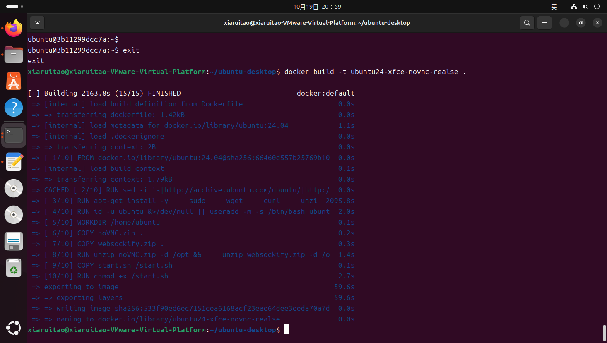
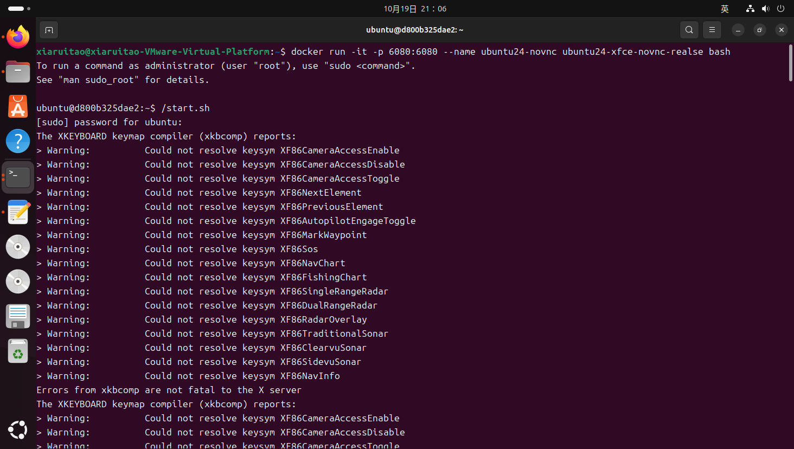
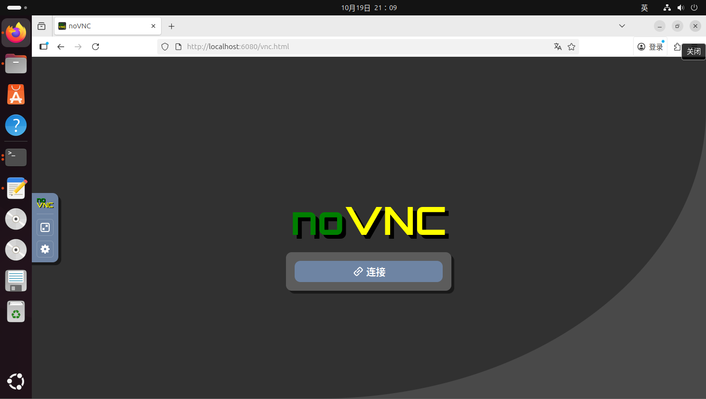
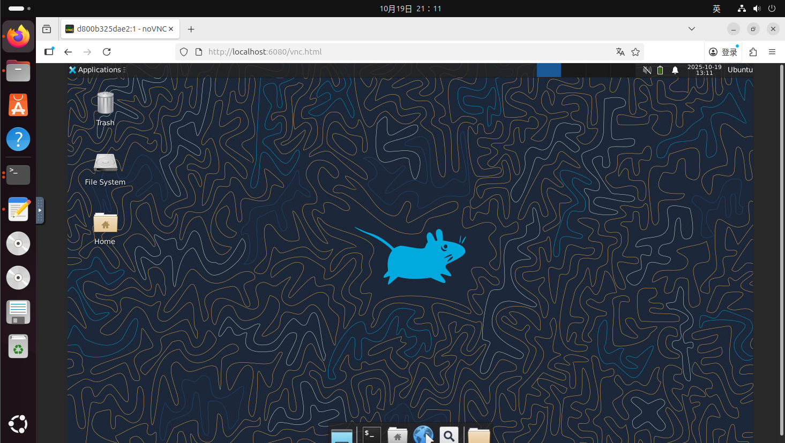

# Docker-Ubuntu24-XFCE-noVNC
**备注：使用ChatGPT辅助完成，通过dockerfile构建具有desktop的Ubuntu24的镜像**

## 文件结构
- **ubuntu24_docker_desktop**
  - Dockerfile
  - noVNC.zip
  - README.txt
  - start.sh
  - websockify.zip

noVNC.zip和websockify.zip为下载的zip文件，由于noVNC和websockify对网络的要求故提前下载好方便使用。

README.txt包含启动镜像的命令及浏览器连接URL地址案例

start.sh为启动相关服务的脚本

## 步骤

### 1.通过Dockerfile构建镜像

**在Dockerfile所在目录下打开终端运行以下命令:**

```docker build -t ubuntu24-xfce-novnc-realse .```

ubuntu24-xfce-novnc-realse为生成的镜像名称

.  为Dockerfile所在目录

**此过程可能需要10-30分钟**



### 2.启动镜像

**运行以下命令启动容器:**

```docker run -it -p 6080:6080 --name ubuntu24-novnc ubuntu24-xfce-novnc-realse bash```

6080为浏览器连接端口

ubuntu24-novnc为容器名称

bash为进入容器的命令

### 3.启动相关服务

**控制台中运行以下命令:**

```/start.sh```

默认密码为: ```ubuntu```



### 4.浏览器连接

**浏览器中输入:**

```http://localhost:6080/vnc.html```



**点击连接**



**大功告成**